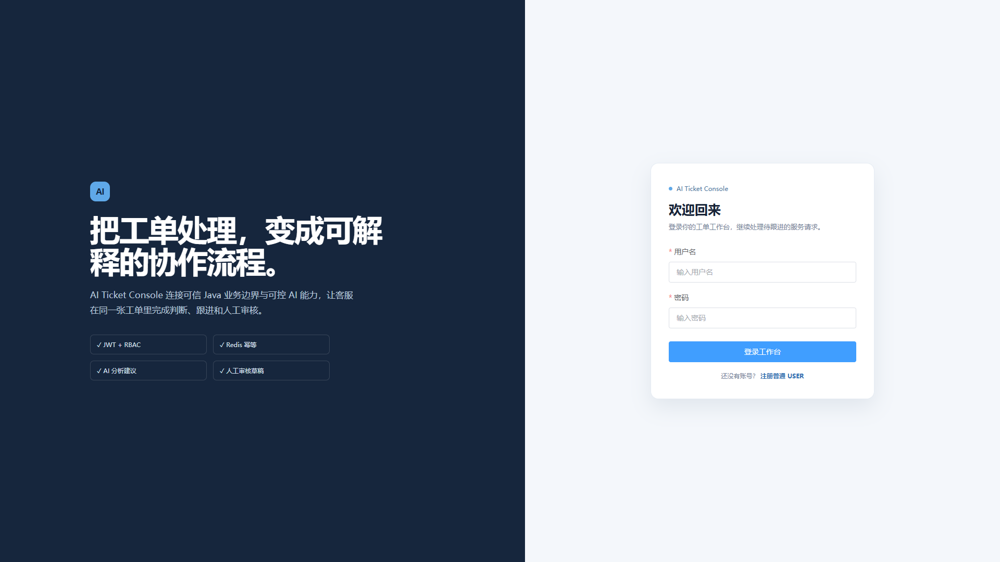
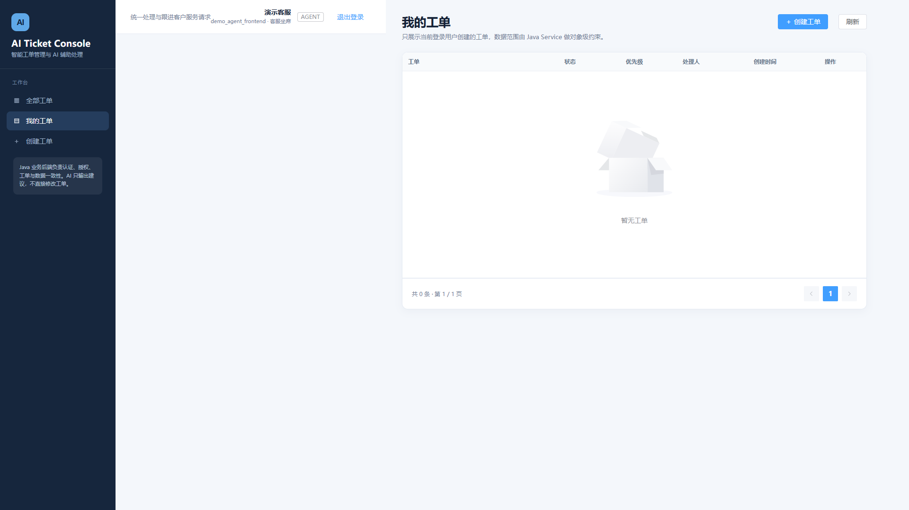
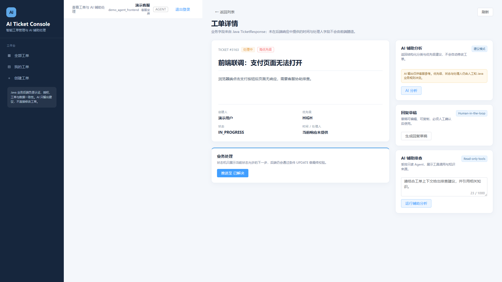
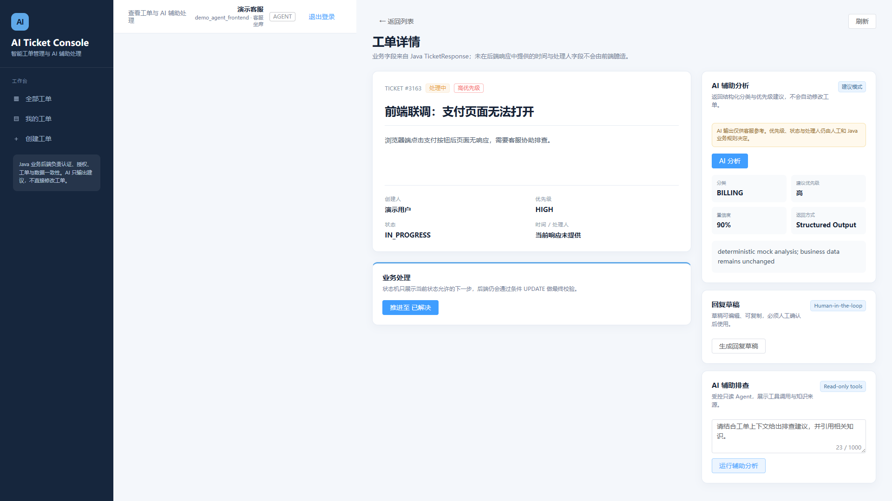
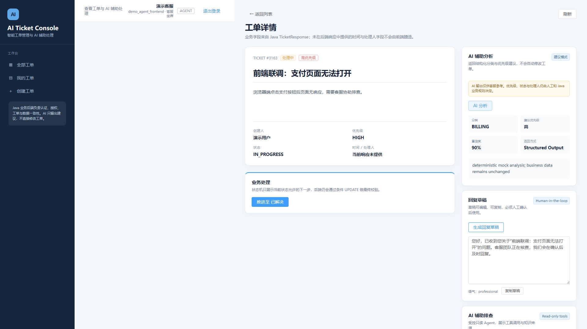

# AI Ticket Console

一个用于 GitHub 展示、简历截图和面试演示的 Vue 3 工单管理 Demo。前端通过 Vite 代理只访问 Java Spring Boot 业务 API；Java 仍然是认证、授权、工单状态和数据一致性的可信边界，浏览器不会直连 Python AI 内部接口。

这不是生产前端或第二套业务后端，而是一个独立的 AI Ticket Console：用于展示真实接口、角色差异、AI 辅助处理和 Python 故障隔离。

## 技术栈

- Vue 3 + Composition API + TypeScript
- Vite 8、Vue Router 5、Axios、Element Plus
- Vite 开发代理：`/api`、`/actuator` → `http://127.0.0.1:8080`
- 同级后端：`../ai-ticket-platform`（Java :8080）和 `../ai-ticket-ai-service`（Python :8000）

## 页面与角色

| 路由 | 角色 | 用途 |
| --- | --- | --- |
| `/login` | 匿名 | JWT 登录 |
| `/register` | 匿名 | 仅注册普通 USER |
| `/tickets/mine` | USER / AGENT / ADMIN | 当前用户自己的工单 |
| `/tickets/create` | USER / AGENT / ADMIN | 创建工单，携带稳定的 Idempotency-Key |
| `/tickets` | AGENT / ADMIN | 条件分页查看全部工单 |
| `/tickets/:id` | 已认证 | 工单详情；客服角色额外看到状态和 AI 能力 |

后端角色和对象级授权才是最终安全边界；路由守卫和菜单隐藏只是浏览器体验层。ADMIN 的指派入口使用后端实际支持的 AGENT 用户 ID 输入，没有虚构不存在的用户列表 API。

## 本地运行

```powershell
npm install
npm run dev
```

默认打开 <http://127.0.0.1:5173>。先启动 Java 后端和其依赖的 MySQL、Redis；如需 AI 分析，再启动同级 Python 服务（默认 :8000）。

```powershell
# Java 项目
cd ..\ai-ticket-platform
mvn spring-boot:run

# Python 项目（另一个终端）
cd ..\ai-ticket-ai-service
uvicorn app.main:app --host 127.0.0.1 --port 8000
```

可以通过 `.env` 覆盖前端 API base path（示例见 `.env.example`），但正常开发使用 Vite proxy，不需要在组件里写后端绝对地址。

## Demo 流程

1. 用注册页创建 USER，登录后创建一张工单。
2. 用后端准备好的 AGENT/ADMIN 账号登录，打开全部工单和工单详情。
3. 在详情页推进合法的顺序状态，运行 AI Analysis、Reply Draft 和只读 Agent。
4. 停止 Python 服务，AI 卡片显示“AI 服务暂时不可用”，普通列表和详情仍由 Java 正常提供；重新启动 Python 后 AI 恢复。

## 安全与边界

- 浏览器只调用 Java `/api/**` 和 `/actuator/**`，不调用 Python `/internal/**`。
- access token 仅为本地 Demo 保存在 `localStorage`，生产环境应结合更严格的 Token 存储、XSS 防护和 CSRF 策略。
- AI analysis 是结构化建议；reply draft 必须人工审核；Agent 工具是受控只读能力。前端没有“一键应用 AI 优先级”或自动发送回复按钮。
- `Idempotency-Key` 按一次逻辑创建操作生成 UUID；请求失败重试复用 key，修改 payload 后才生成新 key。

## 开发检查

```powershell
npm run build
```

当前 Demo 不包含前端数据库、用户系统或 Python 凭证，`.env`、`dist` 和 `node_modules` 不应提交。

## 测试证据

- Frontend：`npm run build` 已通过；构建包含 TypeScript 类型检查和 Vite production bundle。
- Java Backend：`463 tests passed`。
- Python AI Service：`12 passed`。

这些数字来自三个仓库各自的验证命令，不代表 463 个前端或跨服务端到端测试。

## Related Repositories

- [Java Core Backend](https://github.com/zc2777038647/ai-ticket-platform)：可信业务边界，负责认证、授权、工单和 AI 入口。
- [Python AI Service](https://github.com/zc2777038647/ai-ticket-ai-service)：内部 AI capability service，浏览器不直接访问。

## Known Limitations

- access token 使用 `localStorage` 仅用于本地 Demo；生产环境需要更严格的 Token 存储、XSS 和 CSRF 策略。
- 当前 Java `TicketResponse` 未提供处理人和时间字段时，页面会明确显示“响应未提供”，不会伪造数据。
- 当前没有 AGENT 列表 API，ADMIN 指派使用后端实际支持的 AGENT 用户 ID 输入。
- 当前 AI 演示使用后端 fake provider；真实外部 LLM 凭证不写入仓库。

## 页面截图






